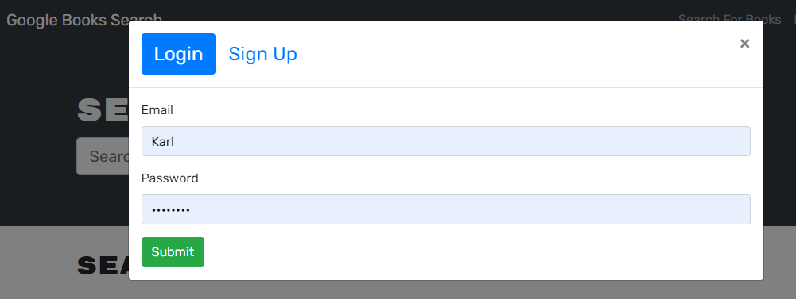
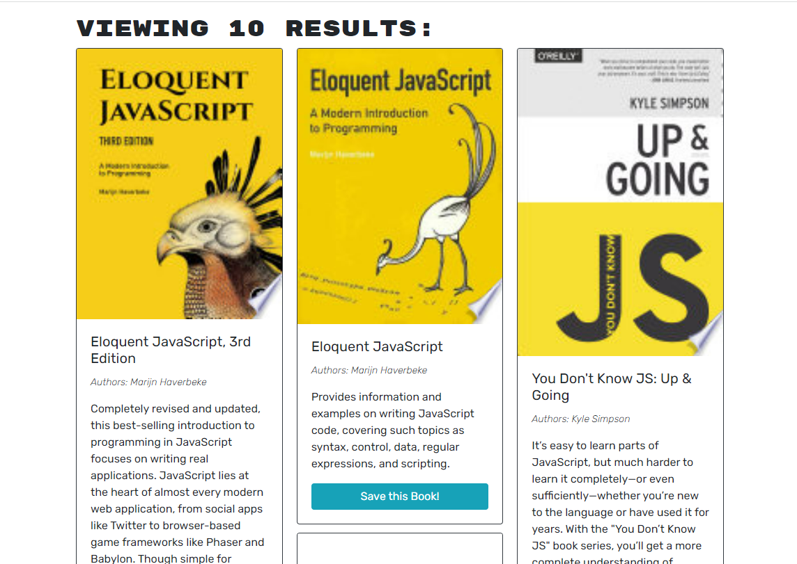
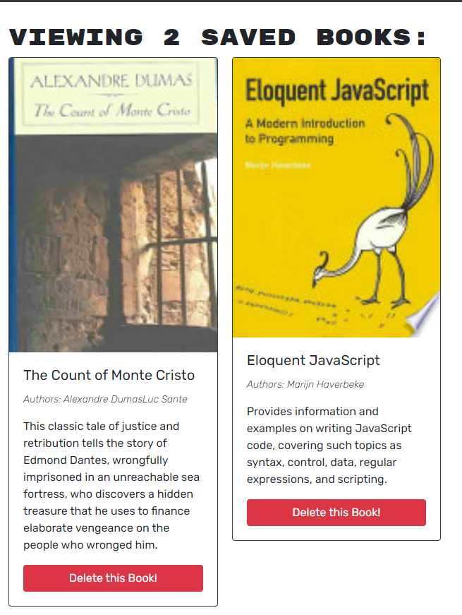

# apollo-book-search
A Google Books API refactored from RESTful API to run with GraphQL and Apollo Server.

## Developer Info  
- Developed by Karl Linfeldt 
- [Live Page Deployment](https://apollo-book-search-google.herokuapp.com/)
- [Github Repo](https://github.com/KarlOL82/apollo-book-search)  
- [email](mailto:klinfeldt@gmail.com)  

## User Story  
AS AN avid reader
I WANT to search for new books to read
SO THAT I can keep a list of books to purchase  

## Overview  
This application was built with the MERN stack (React Front end, MongoDB database, and Node.js/Express.js server) and refactored from a RESTful API to GraphQL API with an Apollo server. It is a simple Google Books API search engine that allows users to search for books, save books from the search that they are interested in, and remove books from their saved results. Users can also create a unique username and log in with a saved email address and password. Users are authenticated with JWT.  

## ## Istalling and Running the App  
No installation is required for this application as it is deployed as a live Heroku app. Simply navigate to the url in the above link and enter a book title to see search results. In order to save your results, you will need to login or create a new account if you are a first-time user. Once logged in, you can click the save button on any book and access your list of saved books at any time as long as you are logged in. Books can be removed from your saved library simply by clicking the "Delete this Book!" button.  

## License
    
  https://opensource.org/licenses/MIT  

  This application is using the MIT license.  

##  Screenshots  

  

  

  

